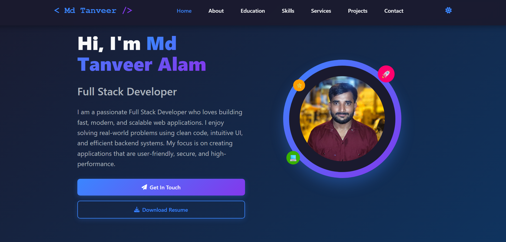

# Md Tanveer Alam - Full Stack Developer Portfolio

A modern, responsive portfolio website showcasing my skills, projects, and experience as a Full Stack Developer.

## 🚀 Features

- **Responsive Design** - Works perfectly on all devices
- **Dark/Light Theme** - Toggle between themes
- **Smooth Animations** - CSS animations and transitions
- **Interactive Projects** - Filterable project gallery
- **Contact Form** - Integrated with Formspree
- **Mobile-Friendly** - Hamburger menu for mobile devices

## 🛠️ Tech Stack

### Frontend
- HTML5
- CSS3 (CSS Variables, Flexbox, Grid)
- JavaScript (ES6+)
- Font Awesome Icons

### Backend & Tools
- Formspree (Contact Form Handling)
- Git & GitHub
- Responsive Design Principles
  
## 🎯 Sections

1. **Hero** - Introduction and call-to-action
2. **About** - Personal information and experience
3. **Skills** - Technical stack and proficiencies
4. **Services** - Web development, mobile apps, UI/UX design
5. **Projects** - Featured work with filter options
6. **Contact** - Contact form and information
7. **Footer** - Social links and quick navigation

## 🚀 Simply visit the live demo

## 🌐 Live Demo

[**View Live Portfolio**](https://mdtanveeralam.vercel.app/)

## 📧 Contact

- **Email:** mdtanweeralam0002@gmail.com
- **LinkedIn:** [Md Tanveer Alam](https://www.linkedin.com/in/md-tanveer-alam-b7a134219/)
- **GitHub:** [mdtanveer0786](https://github.com/mdtanveer0786)

## 🤝 Contributing

Feel free to fork this project and submit pull requests for any improvements.

## 📄 License

This project is open source and available under the MIT License.

---

### ⭐ If you like this portfolio, don't forget to give it a star!

**Built with ❤️ by Md Tanveer Alam**

